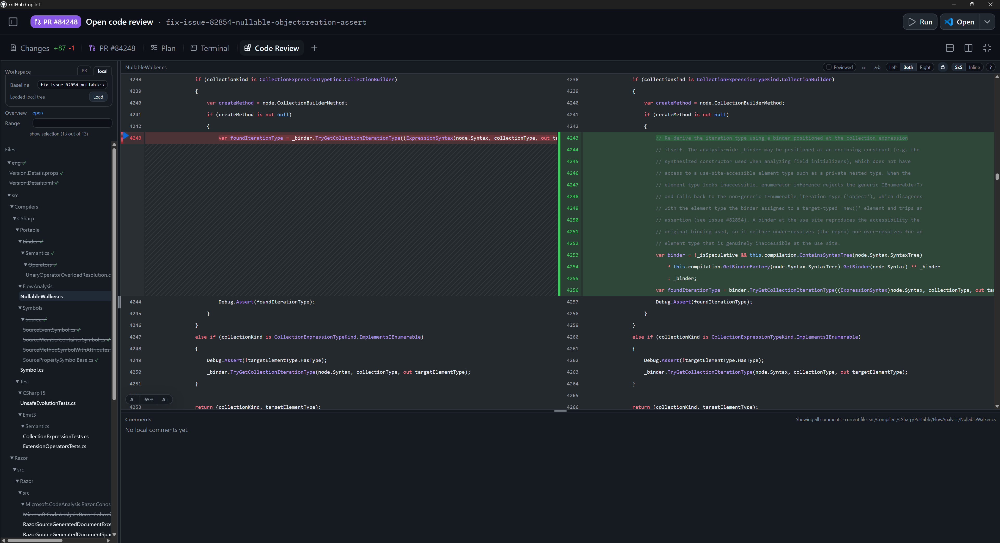

# Code review canvas

Code reviews are becoming an even greater portion of a software developer's responsibility, yet we lack good code review tooling.   
The Roslyn team has been using an internal tool for most of our code reviews (CodeFlow). It's a great tool that we've used for years. But it is barely maintained and is not getting updated for our agentic world.

Here are some of the requirements for the basic code review experience:
- robust comment tracking and conventions so that comments don't get lost
  - we need clear workflow and ownership for comments: "active" comments are for the PR owner to address, "resolved" comments are back in the reviewer's camp, and the reviewer is responsible for marking their comments as "closed"
  - a reviewer should be able to go back and see all of their comments (compact/centralized list of comments with sorting, filtering and searching)
- facilitate incremental review: I left some comments and a review on commit 5, the tool should remember that and let me see changes from commit 6 onwards
- powerful diff: Reviewers need to be able to look at the entire file, sometimes at other files (not part of the PR), not a few lines around a diff hunk

CodeFlow handled these very well, but this experience needs to be adjusted in two main ways to better support agentic development:
1. we need to review code locally before it's in a PR and have a feedback loop with the agent that's making the change
2. AI should help us in the review process:
   - by walking the reviewer through a change ([linear walkthrough](https://github.com/jcouv/dotfiles/tree/main/copilot/skills/linear-walkthrough))
   - by answering inline reviewer questions about the change and codebase
   - by providing code review feedback of its own

This canvas/extension for GitHub Copilot App is a proof-of-concept for integrating best-in-class code review tooling with the latest agentic support.  

## Screenshots

